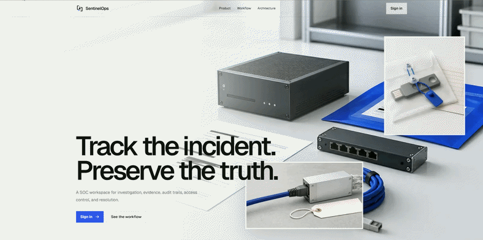
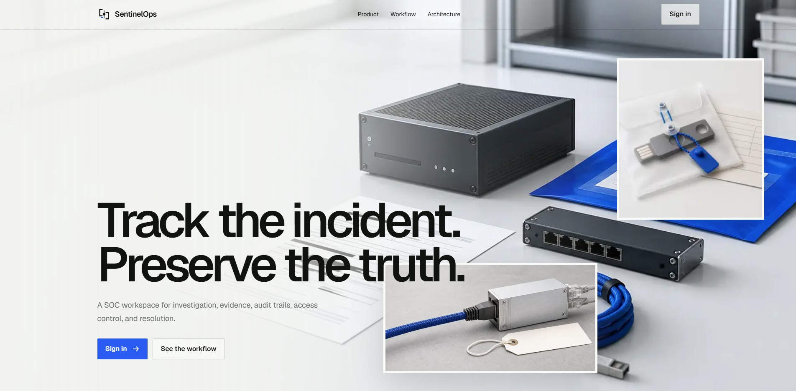
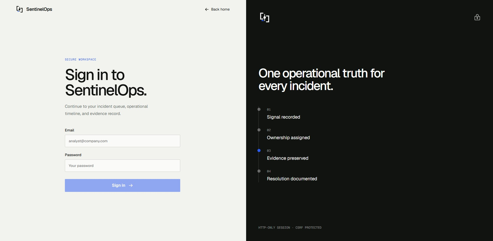
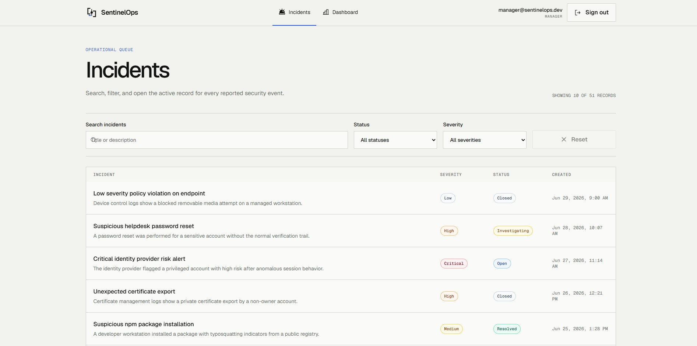
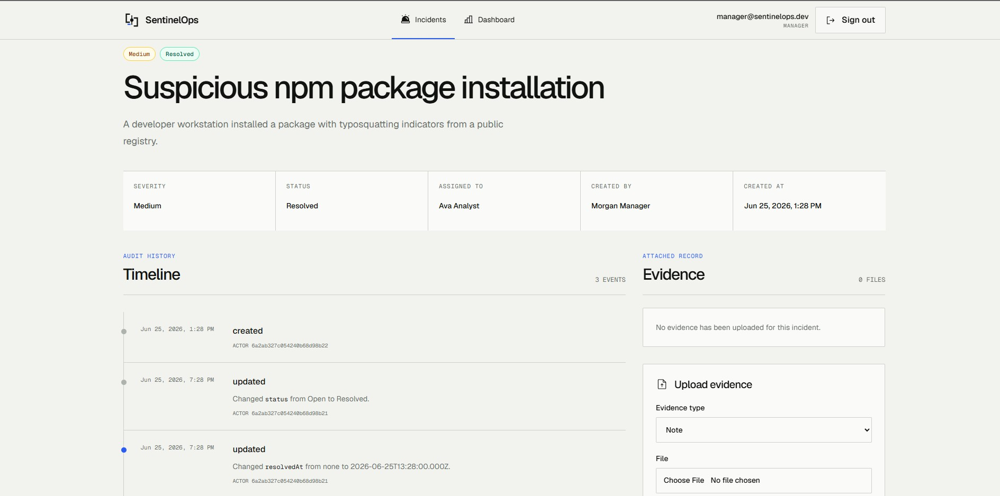
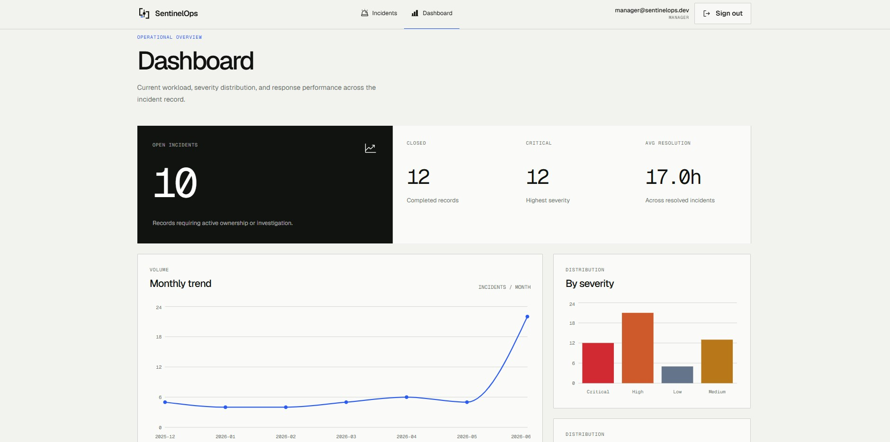

# SentinelOps — Security Incident Management Platform


A SOC-inspired platform for tracking, investigating, and resolving cybersecurity
incidents — built with **Next.js**, **NestJS**, and **MongoDB**. It covers the
full incident lifecycle: creation, assignment, an immutable audit timeline,
evidence collection, role-based access, and an analytics dashboard.


<p align="center">
  
</p>

## Screenshots

| | |
|---|---|
|  |  |
| **Landing page** | **Sign in** |
|  |  |
| **Incident queue** — search, status and severity filters, pagination | **Incident record** — audit timeline and evidence upload |
|  | |
| **Dashboard** — totals, monthly trend, severity distribution | |

## Features

- **Incident lifecycle** — incidents move through `Open → Investigating → Resolved → Closed`, with severity, assignee, and creator.
- **Audit timeline** — every create and field change is appended to the incident with the actor and timestamp.
- **Evidence** — attach screenshots, logs, and notes (PNG, JPEG, text, PDF, JSON; up to 7 MB each).
- **Search and filters** — full-text search on title and description, filter by status and severity, paginated results.
- **Dashboard** — open, closed, and critical counts, average resolution time, monthly volume, and breakdowns by severity and status.
- **Role-based access** — `analyst` and `manager` roles; deleting an incident requires `manager`.

## Data model

The main design decision is what to embed and what to reference.

| Collection | Relationship | Why |
|---|---|---|
| `incidents.timeline` | **Embedded** array inside each incident | The timeline belongs to one incident, only grows, and is always read with it. One query returns both. |
| `evidence` | **Separate collection**, references `incidentId` | Evidence can grow without bound and is only needed on the detail page. Keeping it out of the incident keeps incident reads small and avoids the 16 MB document limit. |
| `users` | **Referenced** from `assignedTo`, `createdBy`, `uploadedBy` | Users are shared across many incidents. Referencing avoids copying names and roles that can change. |

**Indexes** (defined in the Mongoose schemas):

- `incidents`: `status`, `severity`, `assignedTo`, `createdAt` (descending), a compound `{ status, severity }` for combined filters, and a text index on `{ title, description }` for search.
- `evidence`: `{ incidentId, uploadedAt: -1 }` to list an incident's evidence newest first.

**Dashboard aggregation** — `GET /dashboard/stats` runs one aggregation pipeline with `$facet`, so totals, severity counts, status counts, the monthly trend (`$dateToString` by month), and the average resolution time are computed in a single database round trip.

## Security

- JWT access and refresh tokens are stored in **HTTP-only cookies**. The refresh token cookie is scoped to `/auth`.
- Refresh tokens are **rotated** on every refresh and stored as hashes; comparisons use a timing-safe check.
- **CSRF protection** uses a signed double-submit token: the `csrfToken` cookie must match the `x-csrf-token` header on every state-changing request.
- The frontend retries a request once after a `401` by calling `/auth/refresh`, and sends the user to sign in if the refresh fails.
- **Rate limiting**: 100 requests per minute globally, 5 per minute on login, 20 per minute on refresh.
- `helmet` security headers, CORS restricted to the frontend origin, and `class-validator` on all request bodies.
- Uploads are checked for MIME type and size on the server; the client checks the same rules before sending.

## Tech stack

**Backend** — NestJS · Mongoose · MongoDB · JWT (Passport) · class-validator · Swagger · Helmet · Throttler
**Frontend** — Next.js 16 (App Router) · React 19 · TanStack Query · Axios · Tailwind CSS · Recharts · GSAP · Phosphor Icons

## Getting started

### Prerequisites

- Node.js 20.9 or later
- Docker (for the local MongoDB container)

### 1. Start MongoDB

```bash
docker compose up -d
```

### 2. Configure and run the backend

```bash
cd backend
npm install
cp .env.example .env
```

Fill in `JWT_ACCESS_SECRET`, `JWT_REFRESH_SECRET`, and `CSRF_SECRET` in `.env` (generate each with `openssl rand -hex 64`). Set `SEED_ANALYST_PASSWORD` and `SEED_MANAGER_PASSWORD` to choose the passwords for the demo accounts.

```bash
npm run seed
npm run start:dev
```

The API runs on `http://localhost:4000`. Swagger docs are at `http://localhost:4000/api`.

The seed creates two accounts: `analyst@sentinelops.dev` and `manager@sentinelops.dev`, with the passwords you set in `.env`.

### 3. Run the frontend

```bash
cd frontend
npm install
npm run dev
```

Open `http://localhost:3000`. The frontend calls `http://localhost:4000` by default; set `NEXT_PUBLIC_API_URL` in `frontend/.env.local` to use a different API URL.

## API overview

| Method | Path | Description |
|---|---|---|
| `POST` | `/auth/login` | Sign in and set auth cookies |
| `POST` | `/auth/refresh` | Rotate tokens |
| `POST` | `/auth/logout` | Revoke the refresh token and clear cookies |
| `GET` | `/auth/me` | Current user |
| `GET` | `/incidents` | List incidents (`search`, `status`, `severity`, `page`, `limit`) |
| `POST` | `/incidents` | Create an incident |
| `GET` | `/incidents/:id` | Incident with timeline |
| `PATCH` | `/incidents/:id` | Update an incident (appends timeline events) |
| `DELETE` | `/incidents/:id` | Delete an incident (manager only) |
| `GET` | `/incidents/:id/evidence` | List evidence for an incident |
| `POST` | `/incidents/:id/evidence` | Upload evidence (`multipart/form-data`) |
| `GET` | `/dashboard/stats` | Aggregated dashboard metrics |

Full request and response schemas are in the Swagger UI.

## Project structure

```
SentinelOps/
├── backend/            NestJS API
│   └── src/
│       ├── auth/       login, refresh, CSRF, guards, strategies
│       ├── incidents/  incident CRUD, timeline, search
│       ├── evidence/   file uploads
│       ├── dashboard/  aggregation pipeline
│       ├── users/
│       └── seed.ts
├── frontend/           Next.js app
│   └── src/
│       ├── app/        (marketing), (auth), (workspace) route groups
│       ├── components/
│       ├── lib/        API client, session query, formatters
│       └── types/
├── screenshots/
└── docker-compose.yml  local MongoDB
```

## License

[MIT](./LICENSE) © 2026 LT-Ripjaws
